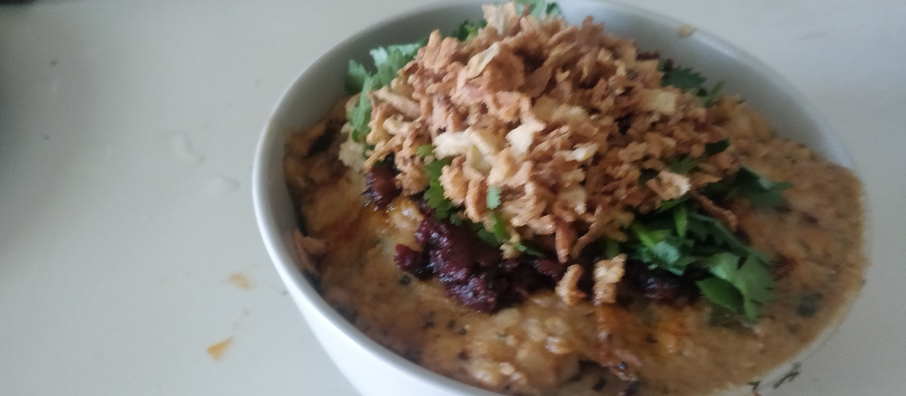

# Lemon Beans and Rice

This is a dish a lot like ful madamus — inspired by, but definitely with my own spin on it. It's rich, a whole meal on its own. Part of the charm of the dish is the layers with different textures, flavors, and even temperatures. It will serve 2 as a hearty meal, 3 or even 4 as a light meal.

Without the cheese, it'd be a solid vegan meal. I think it adds a something that's not easily replaced, but it is far from required.

Our household goes through several pounds of lemons each week, and dishes like this are part of why. There's so much flavor there, it seems silly to waste any of it.

## Sauce

1 (small) can tomato paste

3–4 cloves of garlic

10g herbs — I use parsley and oregano

50ml of olive oil (possibly more!)

splash of wine to deglaze, optional

salt

The sauce is best made in advance — I think it's better cold than warm in this dish. It's my standard red sauce, able to be made in a hurry, but using some techniques for getting a rich, fully-cooked tomato flavor quickly. In other cases I'd add a bit of stock or other liquid to thin it out a bit but in this case the paste-like base state is even better.

Fry several cloves of sliced garlic and a small can of tomato paste in olive oil. A lot of olive oil. The goal is to make a paste that barely can hold together with all the oil by the end. Add parsley and oregano and salt. Keep frying the paste, to caramelize the tomato, so I scrape and flip it over in the oil. The oil eventually starts to combine with the paste, and the paste will be a deep brown-red color. Splash a bit of wine in the pan to deglaze, stir it in, and set the sauce aside. Chill it for this recipe.

## Rice

- 500ml water

- 150g white rice

- 4 bay leaves

- 5-6 cloves or allspice berries

- pinch of salt

Boil the water, add the rice, salt and spices. Drop to very low heat, cook 15 minutes for small-grain rice, 18 for short-grain, 20 for long-grain. Remove from the heat and leave covered. If you get a slight toasty bottom on the rice, it's perfect, but the goal is firm rice just past al dente.

Alternatively, [Cumin and Carrot Rice](Sides/Cumin and Carrot Rice.md)  is delicious instead of this simple white rice.

## Beans

- 500g white beans

- 20g cumin seed

- 2g cinnamon

- 3–4 cloves of garlic

- 1 lemon

- 100ml olive oil

- salt

Cook white beans in advance — lima, fava, cannelini, even great northern. They'll end up mashed so the specifics aren't super important. Cook them to soft and set aside. The liquid can be drained.

Toast cumin seed in a dry pan, then grind.

Remove the seeds from the lemon, then chop it finely or puree it. I like a little texture but puree is easy. Yes, the whole thing. Pith. Zest. All of it. Keep the juice too.

Fry the garlic, then the beans in the olive oil. Add the cumin, cinnamon, and lemon. The spices could be varied, the cumin and lemon are the dishmakers. Let it combine. If you want things even richer, add more oil. The beans should fall apart, though a bit of texture remaining is fine.

## The final dish

- 200g of cream cheese (in rough "slices" for easy distribution), pickled or plain labneh (crumbled), or even cottage cheese. A softish, unripe, white cheese.

- crispy fried onions or garlic for topping

- chopped coriander leaf

- the rice from above

- the sauce from above

- the beans from above

Layer portions in bowls for serving: rice (warm), cheese (cold), beans (warm), sauce (cold), coriander and crispy onions or garlic. 

Serve immediately so the temperatures don't equalize.